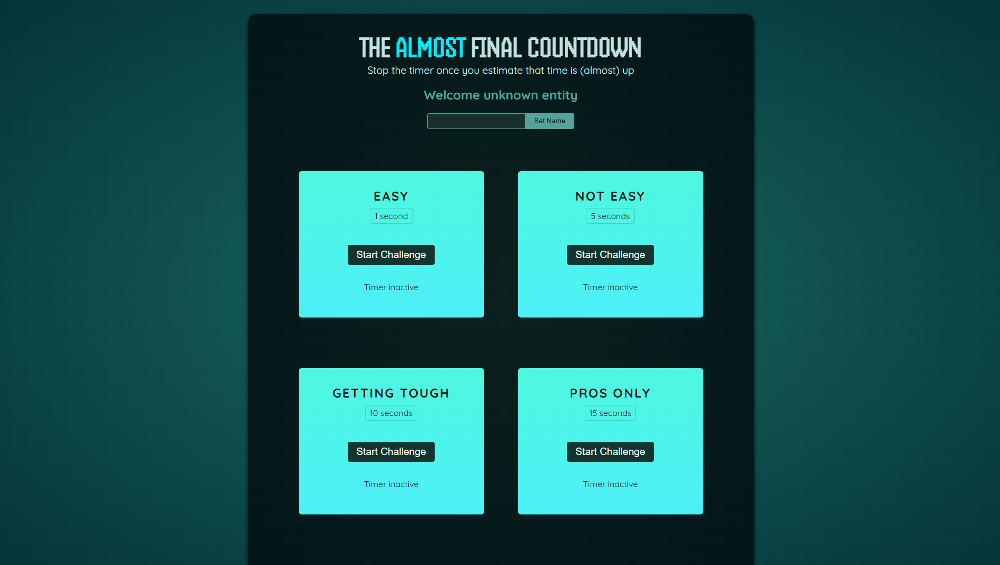

# ⏳ Countdown Challenge

A fun, interactive countdown timer built with **React**. This project was created as a **practice project** inspired by a **Udemy course**.

🔗 **Live Demo:** [countdown-challenge-arunav.netlify.app](https://countdown-challenge-arunav.netlify.app/)

---

## 📸 Screenshots

> 

---

## ✨ Features

- ✅ Set a custom date and time to countdown to.
- ✅ Displays days, hours, minutes, and seconds remaining.
- ✅ Real-time updating timer.
- ✅ Clean and responsive UI.

---

## 🔧 Technologies Used

- ⚛️ **React** (Components, State, Hooks)
- 💅 **CSS** for styling
- 🌐 **Netlify** for deployment

---

## 🎯 Learning Takeaways

- 🎉 Strengthened understanding of React hooks like `useState` and `useEffect`.
- 🕒 Improved handling of real-time updates and intervals in React.
- 🔥 Gained more practice in deploying projects on Netlify.

---

## 📚 Credits

This project is based on a [React course](https://www.udemy.com/course/react-the-complete-guide-incl-redux/) from [Udemy](https://www.udemy.com/) — special thanks to the [instructor](https://www.udemy.com/user/maximilian-schwarzmuller/) for the learning experience!

---

Happy coding! 🚀✨
